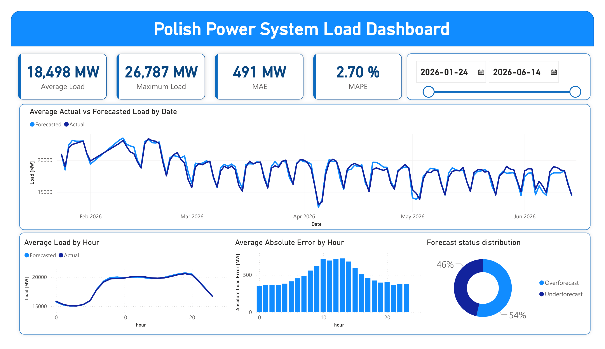

# Polish Electricity Demand & Forecast Performance Analysis

An end-to-end data analytics project analyzing electricity demand and forecast performance in the Polish power system.

The project uses **Python, PostgreSQL, SQL and Power BI** to process system load data, evaluate forecast errors and identify recurring demand patterns.

## Dashboard



## Project overview

The main objective of this project was to analyze historical Polish power system load and evaluate differences between forecasted and actual load.

The analysis focuses on identifying:

* intraday electricity demand patterns,
* peak system load periods,
* hours with the largest forecast errors,
* differences between weekday and weekend load,
* overforecasting and underforecasting patterns.

The final dataset contains **13,436 observations recorded at 15-minute intervals between January and June 2026**.

## Data source

The data was obtained from **Polskie Sieci Elektroenergetyczne S.A. (PSE)** and contains forecasted and actual total load values for the Polish Power System.

Source: PSE – Load of Polish Power System.

## Tools

* **Python**
* **Pandas**
* **PostgreSQL**
* **SQLAlchemy**
* **SQL**
* **Power BI**

## Project workflow

```text
Raw Excel files
        ↓
Python and Pandas preprocessing
        ↓
Cleaned and enriched dataset
        ↓
PostgreSQL database
        ↓
SQL analysis
        ↓
Power BI dashboard
```

## Data preparation

Multiple Excel files were loaded and combined using Pandas.

The preprocessing workflow included:

* locating and sorting source `.xlsx` files,
* concatenating reporting periods into one DataFrame,
* cleaning column names,
* removing duplicate rows,
* checking missing values,
* checking duplicated timestamps,
* creating a complete datetime field,
* sorting observations chronologically,
* validating time differences between consecutive records.

Chronological validation identified two irregularities in the source data:

* a one-week gap between reporting periods,
* a one-hour irregularity related to the daylight-saving-time transition.

Both cases were investigated separately and were not treated as ordinary missing or duplicated records.

## Feature engineering

Calendar features:

* hour,
* weekday,
* weekday number,
* week number,
* month,
* year,
* weekend flag.

Forecast error features:

```text
Forecast Error = Actual Load - Forecasted Load

Absolute Error = |Forecast Error|

APE = |Actual Load - Forecasted Load| / Actual Load × 100%

Squared Error = (Actual Load - Forecasted Load)²
```

Forecast observations were also classified as:

* `Underforecast`
* `Overforecast`
* `Exact`

## SQL analysis

The processed dataset was loaded into PostgreSQL using SQLAlchemy.

SQL was used to calculate aggregations, compare weekday and weekend demand, identify peak-load periods and analyze forecast errors.

Example query used to identify hours with the largest average absolute forecast error:

```sql
SELECT
    hour,
    ROUND(AVG(absolute_error_mw)::NUMERIC, 2)
        AS average_absolute_error_mw
FROM
    fact_power_system_load
GROUP BY
    hour
ORDER BY
    average_absolute_error_mw DESC;
```

The full SQL analysis is available in [`sql/queries.sql`](sql/queries.sql).

## Key results

| Metric              |    Result |
| ------------------- | --------: |
| Average actual load | 18,498 MW |
| Maximum actual load | 26,787 MW |
| MAE                 |    491 MW |
| MAPE                |     2.70% |

Main findings:

* The forecast showed a relatively low average percentage error, with MAPE below 3%.
* Average forecasted load was slightly higher than average actual load.
* 54.77% of observations were overforecasts.
* 45.23% of observations were underforecasts.
* Peak average system load occurred around 19:00.
* The largest average forecast errors occurred around 12:00–13:00.
* Average weekend system load was approximately 15% lower than weekday load.
* The largest forecast errors occurred around midday rather than during the evening demand peak, suggesting that forecast difficulty was not driven solely by the absolute level of system load.

## Power BI dashboard

The Power BI dashboard presents the main system load and forecast performance indicators.

It includes:

* KPI cards,
* date slicer,
* actual vs. forecasted load,
* average load by hour,
* average absolute error by hour,
* forecast status distribution.

## Repository structure

```text
EnergyMarketBoard/
├── data/
│   ├── raw/
│   └── processed/
├── notebooks/
│   ├── 1.exploration.ipynb
│   └── 2.statistical_analysis_and_sql_con.ipynb
├── powerbi/
├── sql/
│   └── queries.sql
├── docs/
│   ├── Report.pdf
│   └── Presentation.pdf
├── Dashboard.png
├── .gitignore
├── README.md
└── requirements.txt
```

## Next steps

Possible extensions of the project include:

* integrating electricity price data,
* including renewable generation data,
* including cross-border electricity flows,
* adding weather and holiday variables,
* analyzing relationships between electricity demand and prices,
* building a short-term load forecasting model,
* automating data ingestion and database updates.